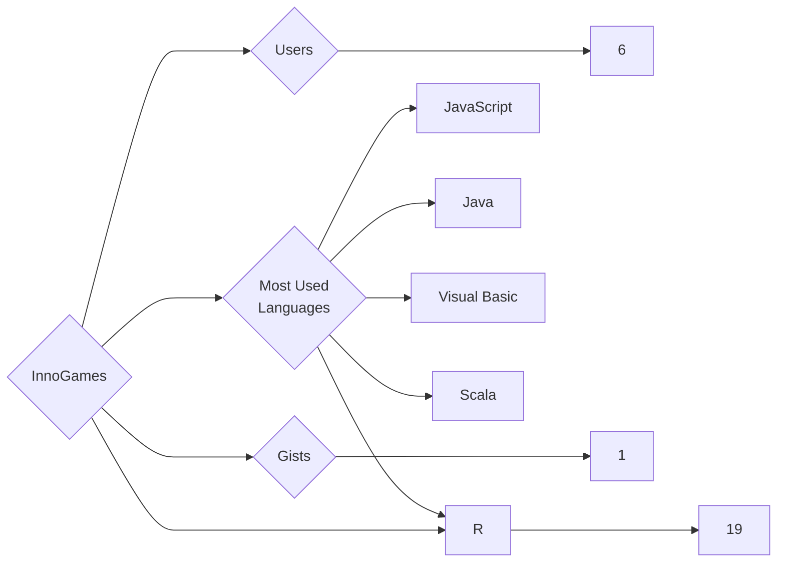

<h1 align="center">InnoGames</h1>

```mermaid
graph LR
COMPANY_NAME{InnoGames}
COMPANY_NAME ---> U{Users} ---> UN[6]
COMPANY_NAME ---> R{Repositories} ---> RN[19]
COMPANY_NAME ---> G{Gists} ---> GN[1]
COMPANY_NAME ---> ML{Most Used<br>Languages}
ML --> JavaScript[JavaScript]
ML --> Java[Java]
ML --> Visual_Basic[Visual Basic]
ML --> Scala[Scala]
ML --> R[R]
```
