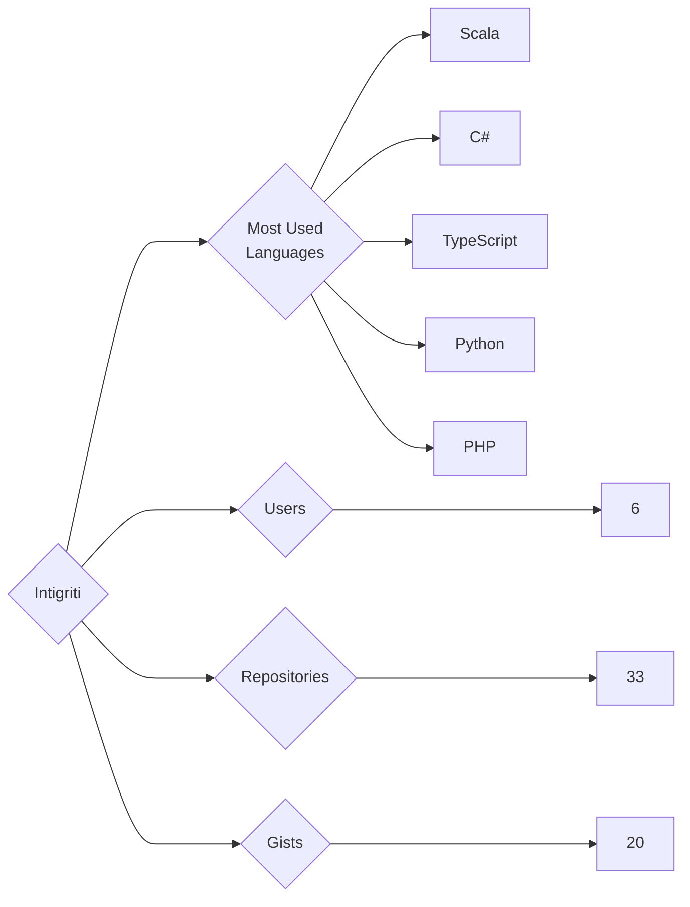

<h1 align="center">Intigriti</h1>

```mermaid
graph LR
COMPANY_NAME{Intigriti}
COMPANY_NAME ---> U{Users} ---> UN[6]
COMPANY_NAME ---> R{Repositories} ---> RN[33]
COMPANY_NAME ---> G{Gists} ---> GN[20]
COMPANY_NAME ---> ML{Most Used<br>Languages}
ML --> Scala[Scala]
ML --> C#[C#]
ML --> TypeScript[TypeScript]
ML --> Python[Python]
ML --> PHP[PHP]
```
