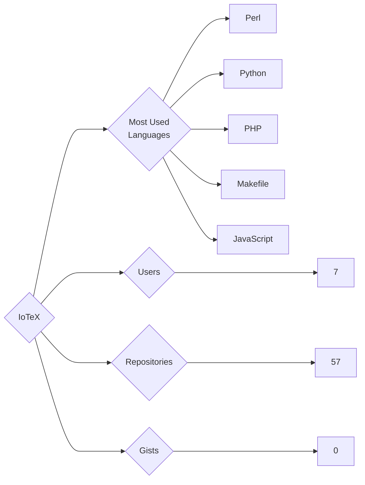

<h1 align="center">IoTeX</h1>

```mermaid
graph LR
COMPANY_NAME{IoTeX}
COMPANY_NAME ---> U{Users} ---> UN[7]
COMPANY_NAME ---> R{Repositories} ---> RN[57]
COMPANY_NAME ---> G{Gists} ---> GN[0]
COMPANY_NAME ---> ML{Most Used<br>Languages}
ML --> Perl[Perl]
ML --> Python[Python]
ML --> PHP[PHP]
ML --> Makefile[Makefile]
ML --> JavaScript[JavaScript]
```
