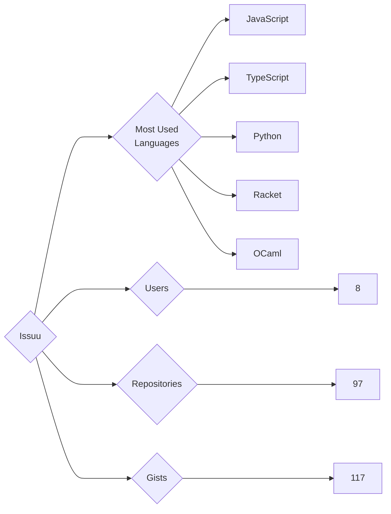

<h1 align="center">Issuu</h1>

```mermaid
graph LR
COMPANY_NAME{Issuu}
COMPANY_NAME ---> U{Users} ---> UN[8]
COMPANY_NAME ---> R{Repositories} ---> RN[97]
COMPANY_NAME ---> G{Gists} ---> GN[117]
COMPANY_NAME ---> ML{Most Used<br>Languages}
ML --> JavaScript[JavaScript]
ML --> TypeScript[TypeScript]
ML --> Python[Python]
ML --> Racket[Racket]
ML --> OCaml[OCaml]
```
