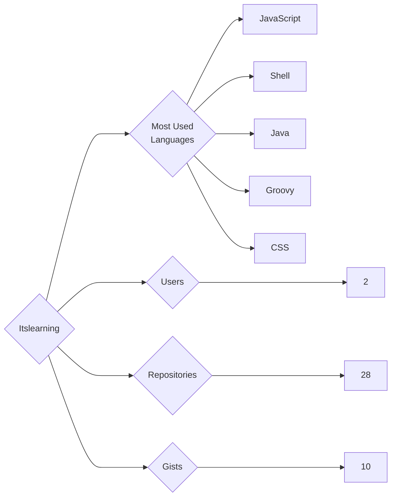

<h1 align="center">Itslearning</h1>

```mermaid
graph LR
COMPANY_NAME{Itslearning}
COMPANY_NAME ---> U{Users} ---> UN[2]
COMPANY_NAME ---> R{Repositories} ---> RN[28]
COMPANY_NAME ---> G{Gists} ---> GN[10]
COMPANY_NAME ---> ML{Most Used<br>Languages}
ML --> JavaScript[JavaScript]
ML --> Shell[Shell]
ML --> Java[Java]
ML --> Groovy[Groovy]
ML --> CSS[CSS]
```
