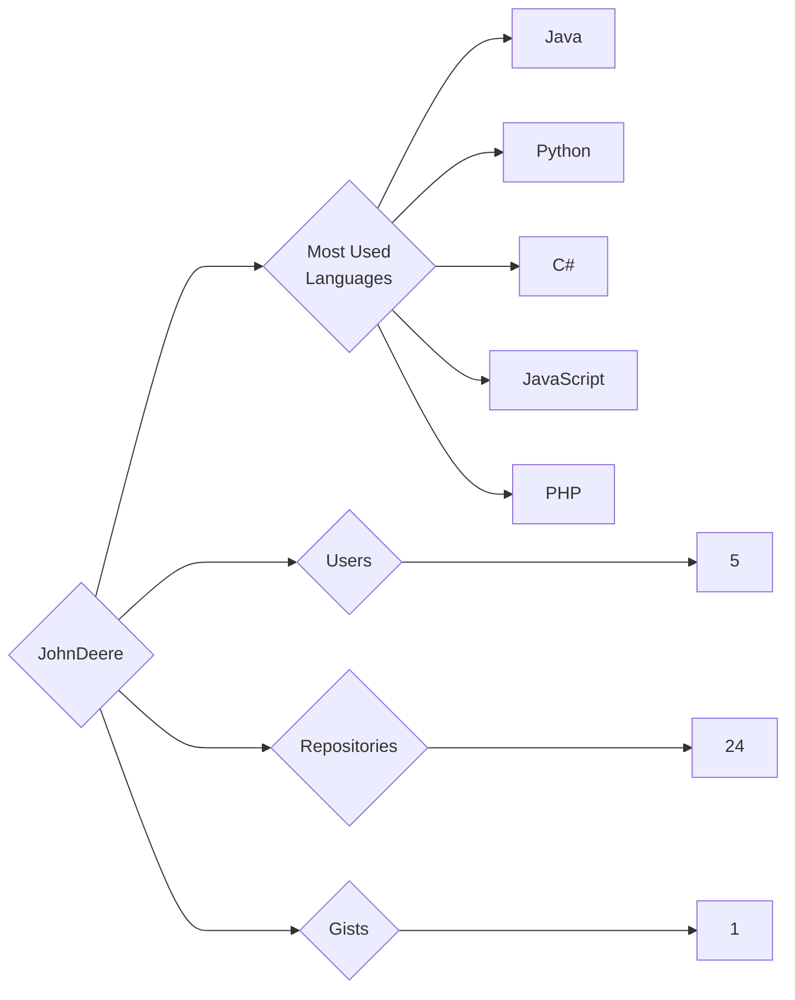

<h1 align="center">JohnDeere</h1>

```mermaid
graph LR
COMPANY_NAME{JohnDeere}
COMPANY_NAME ---> U{Users} ---> UN[5]
COMPANY_NAME ---> R{Repositories} ---> RN[24]
COMPANY_NAME ---> G{Gists} ---> GN[1]
COMPANY_NAME ---> ML{Most Used<br>Languages}
ML --> Java[Java]
ML --> Python[Python]
ML --> C#[C#]
ML --> JavaScript[JavaScript]
ML --> PHP[PHP]
```
