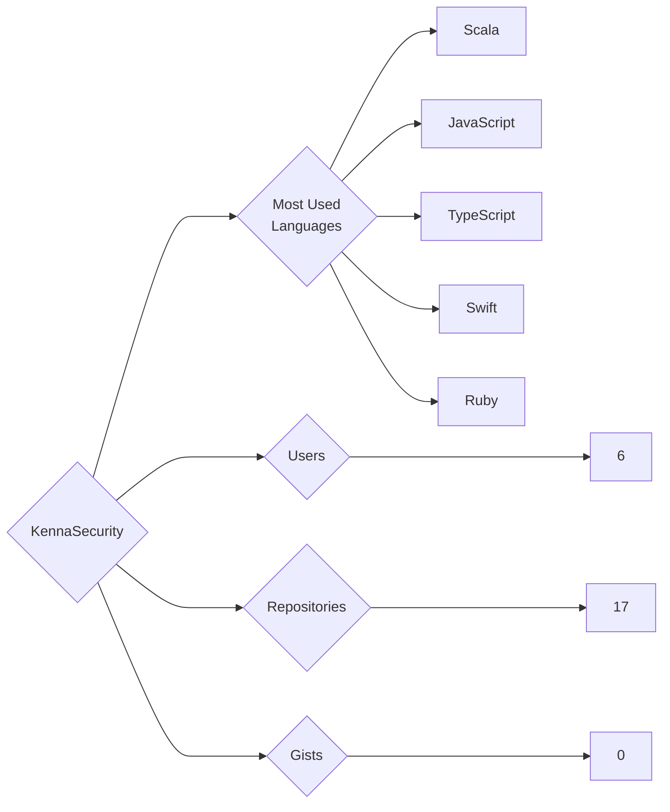

<h1 align="center">KennaSecurity</h1>

```mermaid
graph LR
COMPANY_NAME{KennaSecurity}
COMPANY_NAME ---> U{Users} ---> UN[6]
COMPANY_NAME ---> R{Repositories} ---> RN[17]
COMPANY_NAME ---> G{Gists} ---> GN[0]
COMPANY_NAME ---> ML{Most Used<br>Languages}
ML --> Scala[Scala]
ML --> JavaScript[JavaScript]
ML --> TypeScript[TypeScript]
ML --> Swift[Swift]
ML --> Ruby[Ruby]
```
