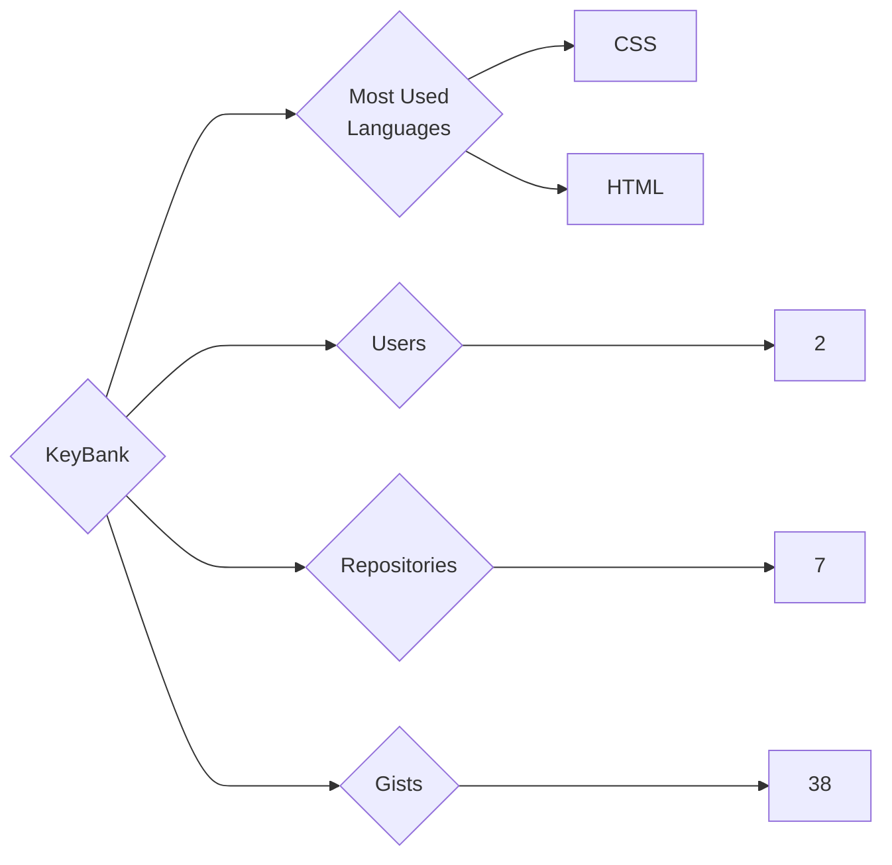

<h1 align="center">KeyBank</h1>

```mermaid
graph LR
COMPANY_NAME{KeyBank}
COMPANY_NAME ---> U{Users} ---> UN[2]
COMPANY_NAME ---> R{Repositories} ---> RN[7]
COMPANY_NAME ---> G{Gists} ---> GN[38]
COMPANY_NAME ---> ML{Most Used<br>Languages}
ML --> CSS[CSS]
ML --> HTML[HTML]
```
