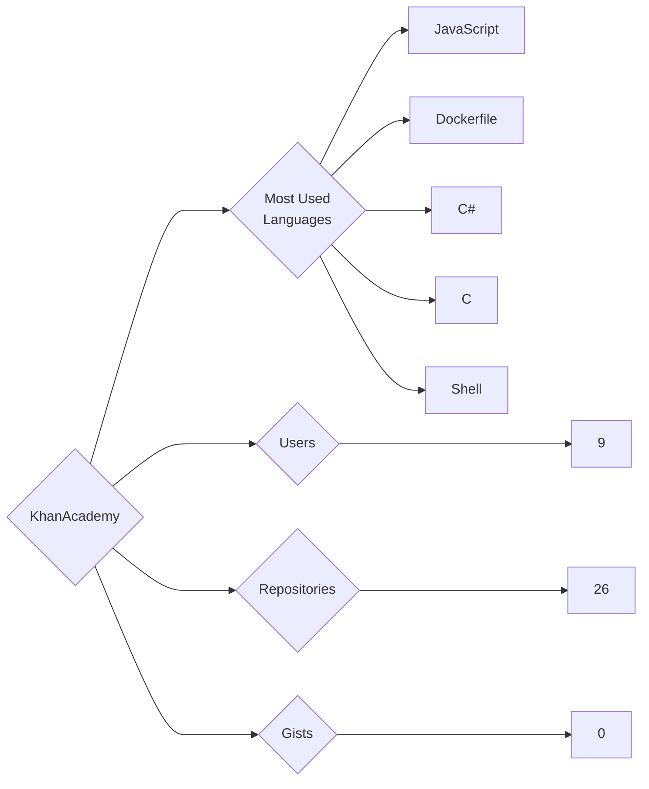

<h1 align="center">KhanAcademy</h1>

```mermaid
graph LR
COMPANY_NAME{KhanAcademy}
COMPANY_NAME ---> U{Users} ---> UN[9]
COMPANY_NAME ---> R{Repositories} ---> RN[26]
COMPANY_NAME ---> G{Gists} ---> GN[0]
COMPANY_NAME ---> ML{Most Used<br>Languages}
ML --> JavaScript[JavaScript]
ML --> Dockerfile[Dockerfile]
ML --> C#[C#]
ML --> C[C]
ML --> Shell[Shell]
```
