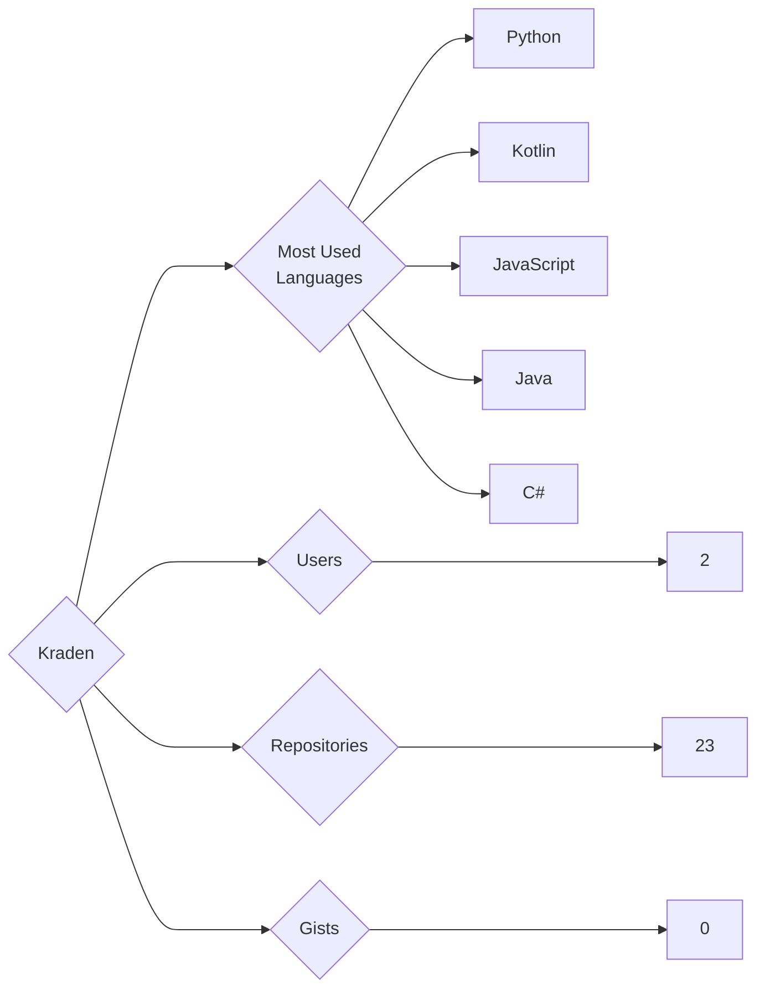

<h1 align="center">Kraden</h1>

```mermaid
graph LR
COMPANY_NAME{Kraden}
COMPANY_NAME ---> U{Users} ---> UN[2]
COMPANY_NAME ---> R{Repositories} ---> RN[23]
COMPANY_NAME ---> G{Gists} ---> GN[0]
COMPANY_NAME ---> ML{Most Used<br>Languages}
ML --> Python[Python]
ML --> Kotlin[Kotlin]
ML --> JavaScript[JavaScript]
ML --> Java[Java]
ML --> C#[C#]
```
