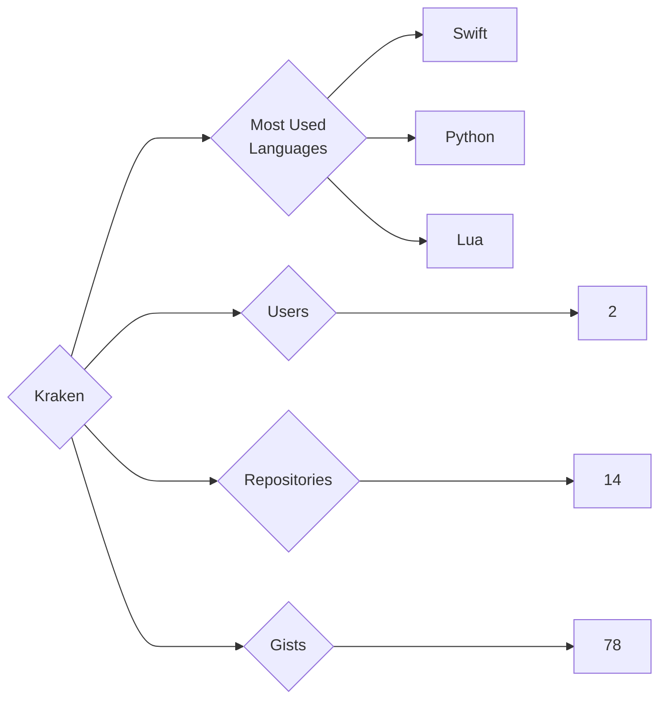

<h1 align="center">Kraken</h1>

```mermaid
graph LR
COMPANY_NAME{Kraken}
COMPANY_NAME ---> U{Users} ---> UN[2]
COMPANY_NAME ---> R{Repositories} ---> RN[14]
COMPANY_NAME ---> G{Gists} ---> GN[78]
COMPANY_NAME ---> ML{Most Used<br>Languages}
ML --> Swift[Swift]
ML --> Python[Python]
ML --> Lua[Lua]
```
