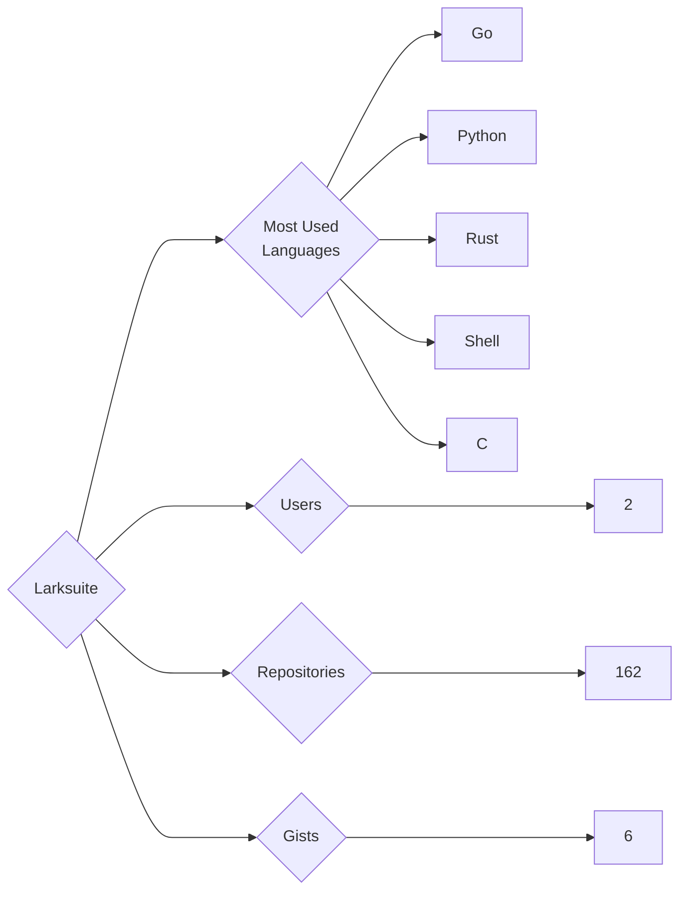

<h1 align="center">Larksuite</h1>

```mermaid
graph LR
COMPANY_NAME{Larksuite}
COMPANY_NAME ---> U{Users} ---> UN[2]
COMPANY_NAME ---> R{Repositories} ---> RN[162]
COMPANY_NAME ---> G{Gists} ---> GN[6]
COMPANY_NAME ---> ML{Most Used<br>Languages}
ML --> Go[Go]
ML --> Python[Python]
ML --> Rust[Rust]
ML --> Shell[Shell]
ML --> C[C]
```
