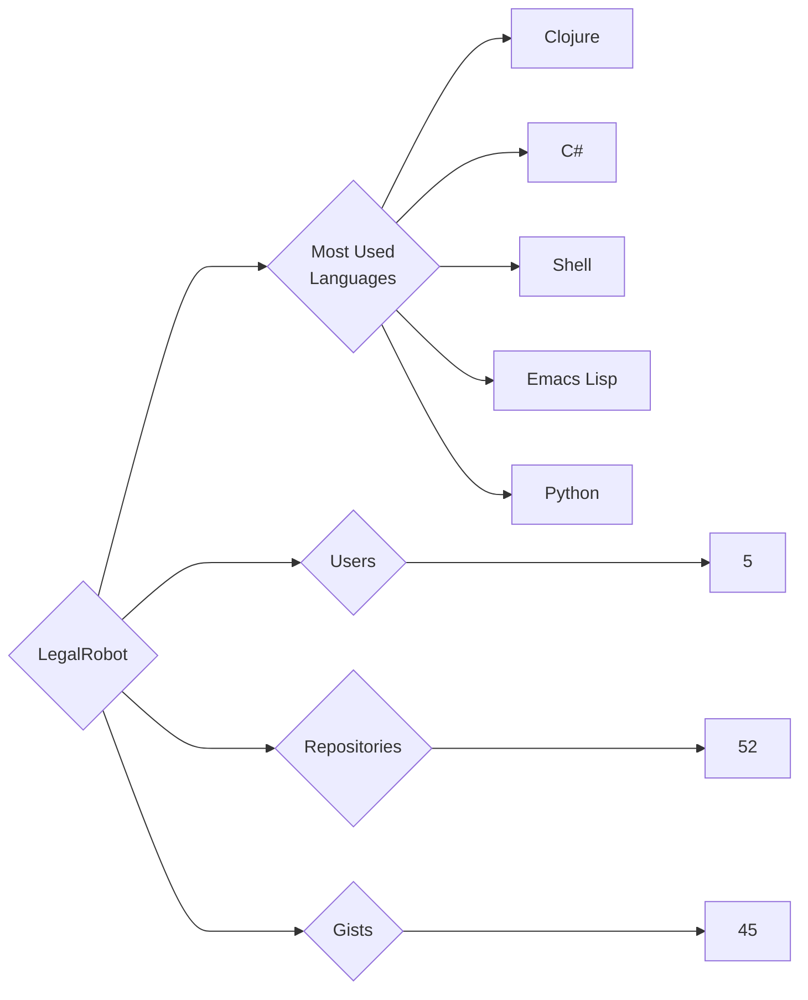

<h1 align="center">LegalRobot</h1>

```mermaid
graph LR
COMPANY_NAME{LegalRobot}
COMPANY_NAME ---> U{Users} ---> UN[5]
COMPANY_NAME ---> R{Repositories} ---> RN[52]
COMPANY_NAME ---> G{Gists} ---> GN[45]
COMPANY_NAME ---> ML{Most Used<br>Languages}
ML --> Clojure[Clojure]
ML --> C#[C#]
ML --> Shell[Shell]
ML --> Emacs_Lisp[Emacs Lisp]
ML --> Python[Python]
```
