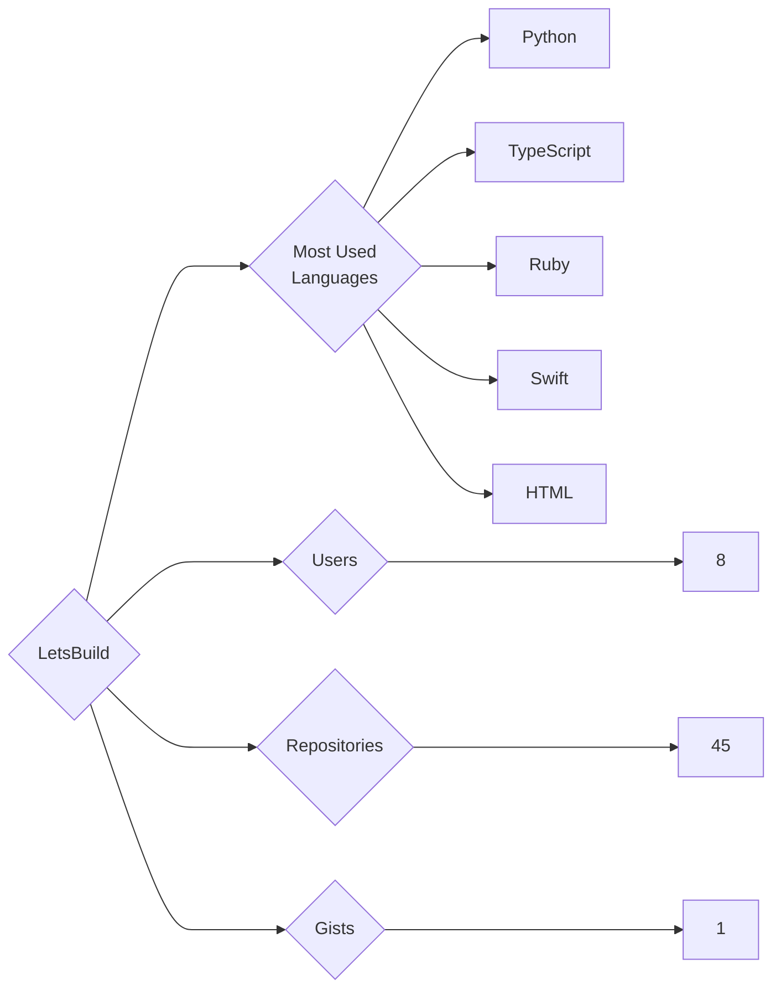

<h1 align="center">LetsBuild</h1>

```mermaid
graph LR
COMPANY_NAME{LetsBuild}
COMPANY_NAME ---> U{Users} ---> UN[8]
COMPANY_NAME ---> R{Repositories} ---> RN[45]
COMPANY_NAME ---> G{Gists} ---> GN[1]
COMPANY_NAME ---> ML{Most Used<br>Languages}
ML --> Python[Python]
ML --> TypeScript[TypeScript]
ML --> Ruby[Ruby]
ML --> Swift[Swift]
ML --> HTML[HTML]
```
