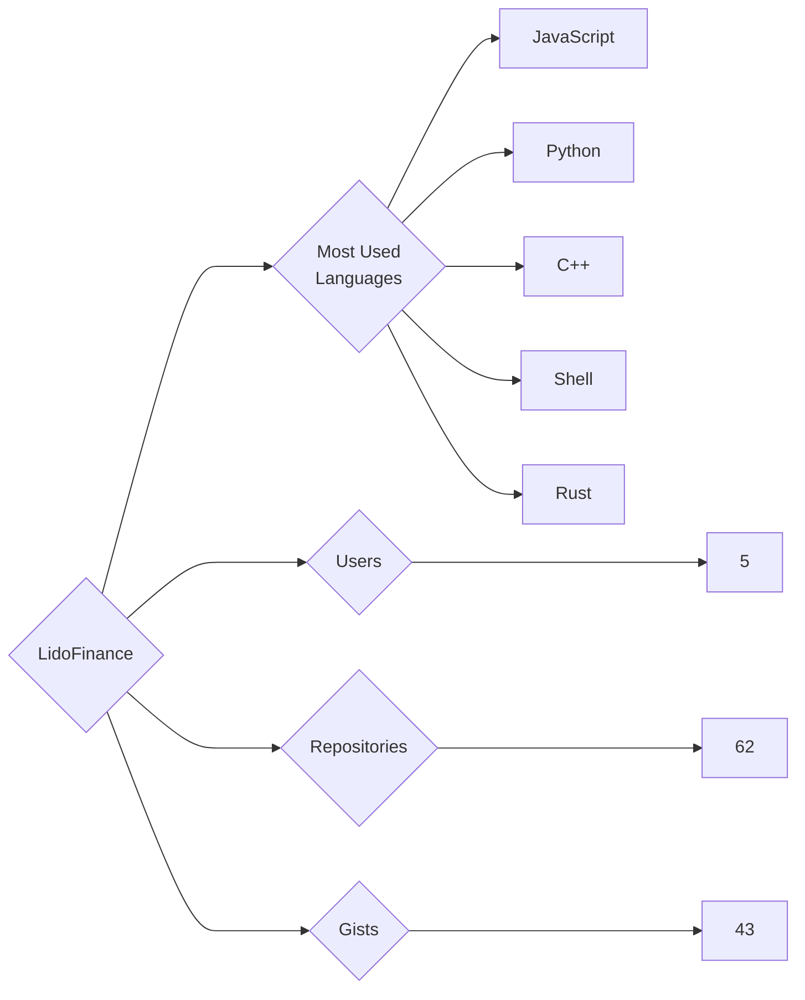

<h1 align="center">LidoFinance</h1>

```mermaid
graph LR
COMPANY_NAME{LidoFinance}
COMPANY_NAME ---> U{Users} ---> UN[5]
COMPANY_NAME ---> R{Repositories} ---> RN[62]
COMPANY_NAME ---> G{Gists} ---> GN[43]
COMPANY_NAME ---> ML{Most Used<br>Languages}
ML --> JavaScript[JavaScript]
ML --> Python[Python]
ML --> C++[C++]
ML --> Shell[Shell]
ML --> Rust[Rust]
```
