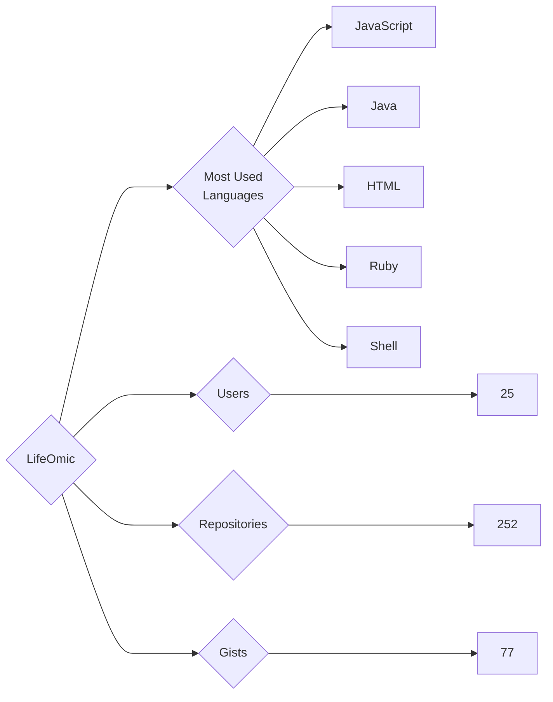

<h1 align="center">LifeOmic</h1>

```mermaid
graph LR
COMPANY_NAME{LifeOmic}
COMPANY_NAME ---> U{Users} ---> UN[25]
COMPANY_NAME ---> R{Repositories} ---> RN[252]
COMPANY_NAME ---> G{Gists} ---> GN[77]
COMPANY_NAME ---> ML{Most Used<br>Languages}
ML --> JavaScript[JavaScript]
ML --> Java[Java]
ML --> HTML[HTML]
ML --> Ruby[Ruby]
ML --> Shell[Shell]
```
