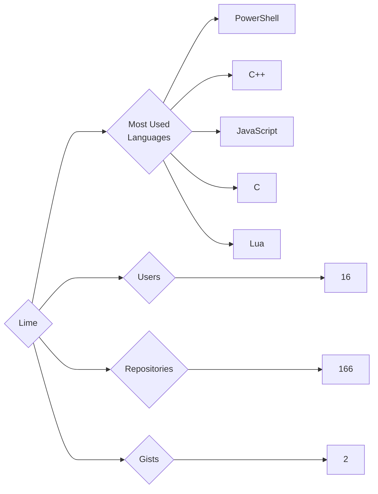

<h1 align="center">Lime</h1>

```mermaid
graph LR
COMPANY_NAME{Lime}
COMPANY_NAME ---> U{Users} ---> UN[16]
COMPANY_NAME ---> R{Repositories} ---> RN[166]
COMPANY_NAME ---> G{Gists} ---> GN[2]
COMPANY_NAME ---> ML{Most Used<br>Languages}
ML --> PowerShell[PowerShell]
ML --> C++[C++]
ML --> JavaScript[JavaScript]
ML --> C[C]
ML --> Lua[Lua]
```
