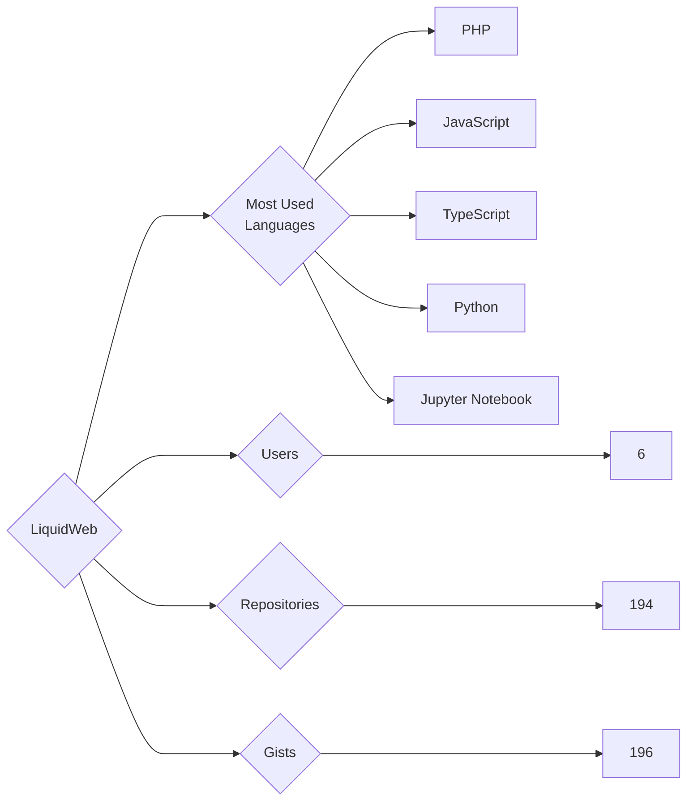

<h1 align="center">LiquidWeb</h1>

```mermaid
graph LR
COMPANY_NAME{LiquidWeb}
COMPANY_NAME ---> U{Users} ---> UN[6]
COMPANY_NAME ---> R{Repositories} ---> RN[194]
COMPANY_NAME ---> G{Gists} ---> GN[196]
COMPANY_NAME ---> ML{Most Used<br>Languages}
ML --> PHP[PHP]
ML --> JavaScript[JavaScript]
ML --> TypeScript[TypeScript]
ML --> Python[Python]
ML --> Jupyter_Notebook[Jupyter Notebook]
```
