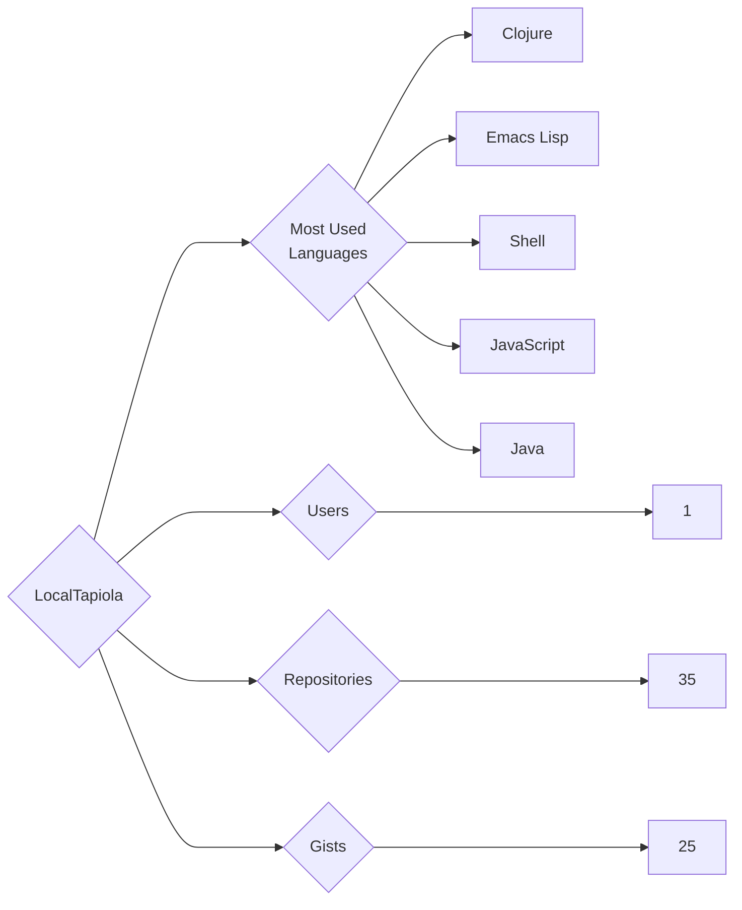

<h1 align="center">LocalTapiola</h1>

```mermaid
graph LR
COMPANY_NAME{LocalTapiola}
COMPANY_NAME ---> U{Users} ---> UN[1]
COMPANY_NAME ---> R{Repositories} ---> RN[35]
COMPANY_NAME ---> G{Gists} ---> GN[25]
COMPANY_NAME ---> ML{Most Used<br>Languages}
ML --> Clojure[Clojure]
ML --> Emacs_Lisp[Emacs Lisp]
ML --> Shell[Shell]
ML --> JavaScript[JavaScript]
ML --> Java[Java]
```
