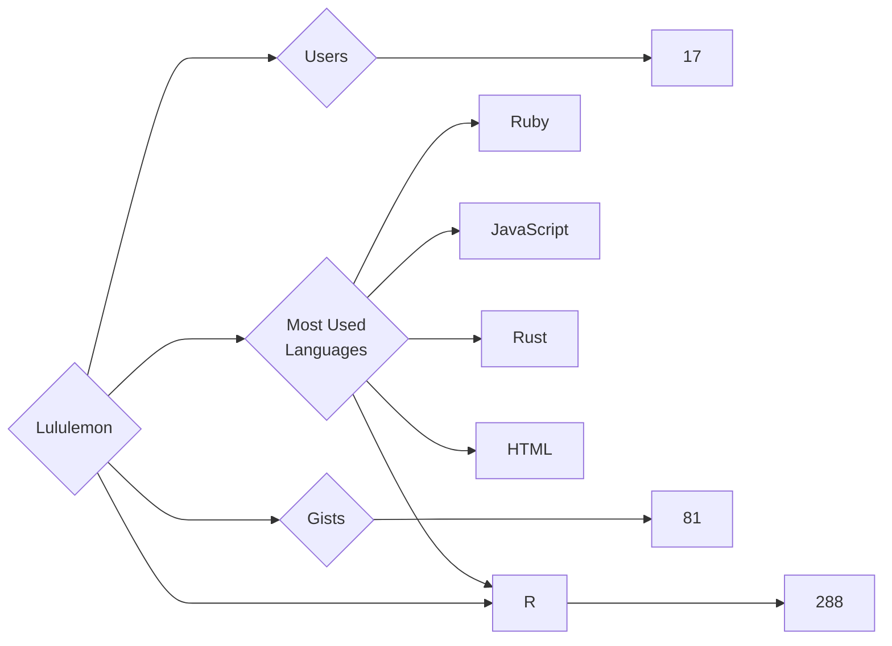

<h1 align="center">Lululemon</h1>

```mermaid
graph LR
COMPANY_NAME{Lululemon}
COMPANY_NAME ---> U{Users} ---> UN[17]
COMPANY_NAME ---> R{Repositories} ---> RN[288]
COMPANY_NAME ---> G{Gists} ---> GN[81]
COMPANY_NAME ---> ML{Most Used<br>Languages}
ML --> Ruby[Ruby]
ML --> JavaScript[JavaScript]
ML --> Rust[Rust]
ML --> R[R]
ML --> HTML[HTML]
```
