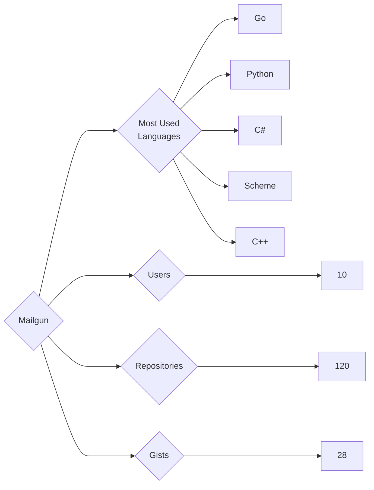

<h1 align="center">Mailgun</h1>

```mermaid
graph LR
COMPANY_NAME{Mailgun}
COMPANY_NAME ---> U{Users} ---> UN[10]
COMPANY_NAME ---> R{Repositories} ---> RN[120]
COMPANY_NAME ---> G{Gists} ---> GN[28]
COMPANY_NAME ---> ML{Most Used<br>Languages}
ML --> Go[Go]
ML --> Python[Python]
ML --> C#[C#]
ML --> Scheme[Scheme]
ML --> C++[C++]
```
