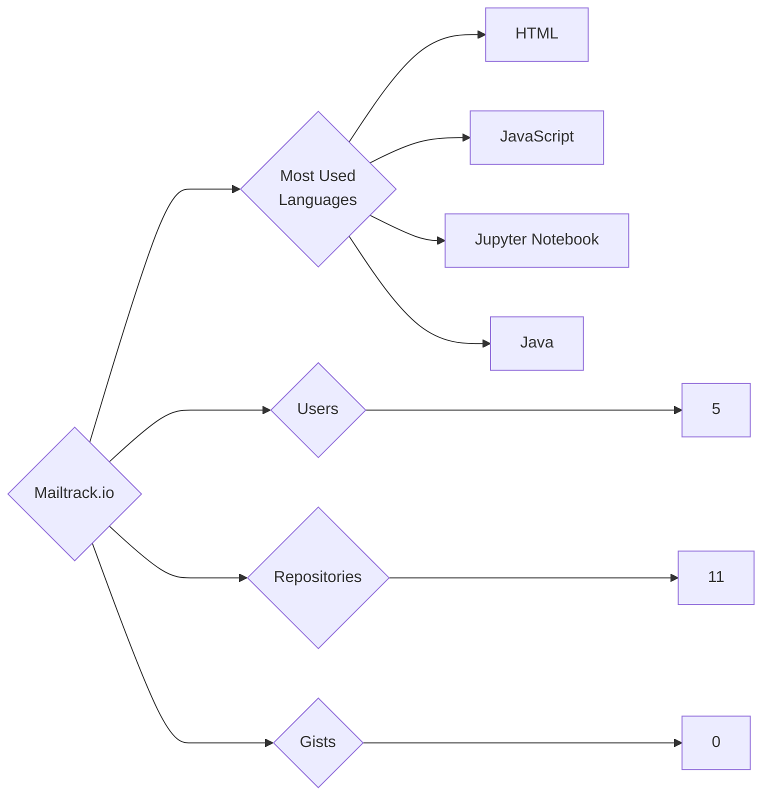

<h1 align="center">Mailtrack.io</h1>

```mermaid
graph LR
COMPANY_NAME{Mailtrack.io}
COMPANY_NAME ---> U{Users} ---> UN[5]
COMPANY_NAME ---> R{Repositories} ---> RN[11]
COMPANY_NAME ---> G{Gists} ---> GN[0]
COMPANY_NAME ---> ML{Most Used<br>Languages}
ML --> HTML[HTML]
ML --> JavaScript[JavaScript]
ML --> Jupyter_Notebook[Jupyter Notebook]
ML --> Java[Java]
```
