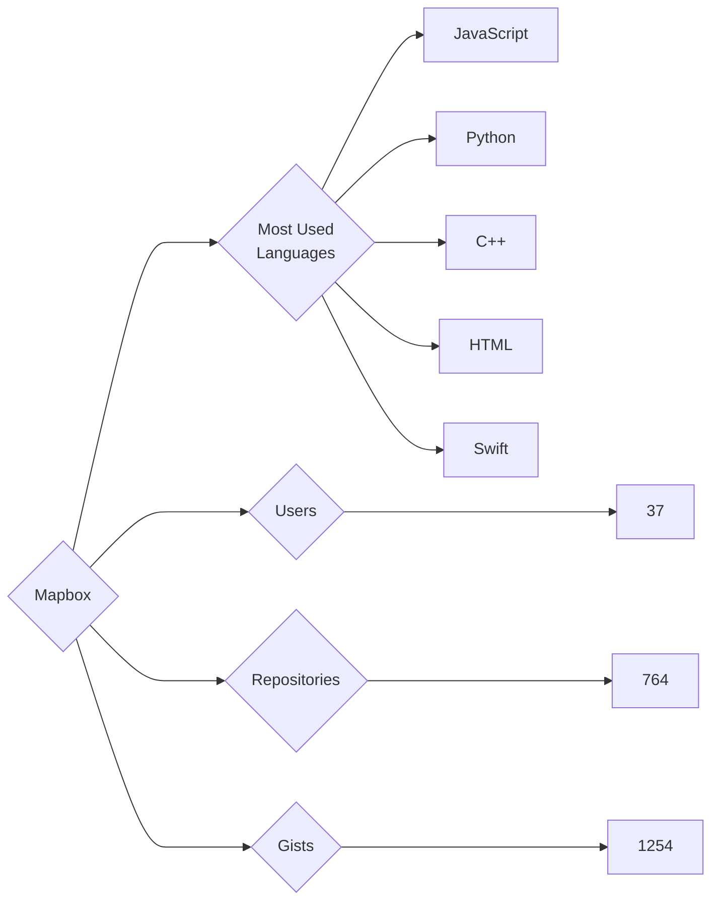

<h1 align="center">Mapbox</h1>

```mermaid
graph LR
COMPANY_NAME{Mapbox}
COMPANY_NAME ---> U{Users} ---> UN[37]
COMPANY_NAME ---> R{Repositories} ---> RN[764]
COMPANY_NAME ---> G{Gists} ---> GN[1254]
COMPANY_NAME ---> ML{Most Used<br>Languages}
ML --> JavaScript[JavaScript]
ML --> Python[Python]
ML --> C++[C++]
ML --> HTML[HTML]
ML --> Swift[Swift]
```
