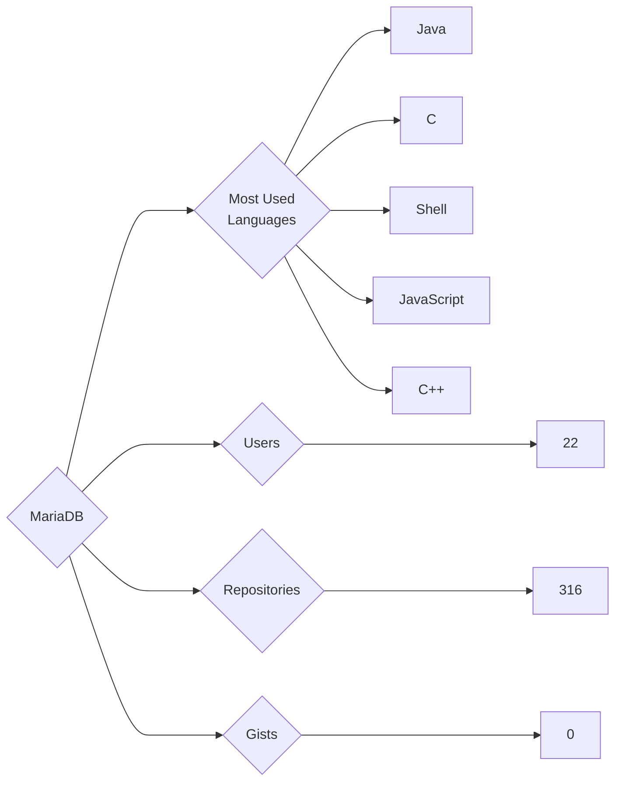

<h1 align="center">MariaDB</h1>

```mermaid
graph LR
COMPANY_NAME{MariaDB}
COMPANY_NAME ---> U{Users} ---> UN[22]
COMPANY_NAME ---> R{Repositories} ---> RN[316]
COMPANY_NAME ---> G{Gists} ---> GN[0]
COMPANY_NAME ---> ML{Most Used<br>Languages}
ML --> Java
ML --> C
ML --> Shell
ML --> JavaScript
ML --> C++
```
