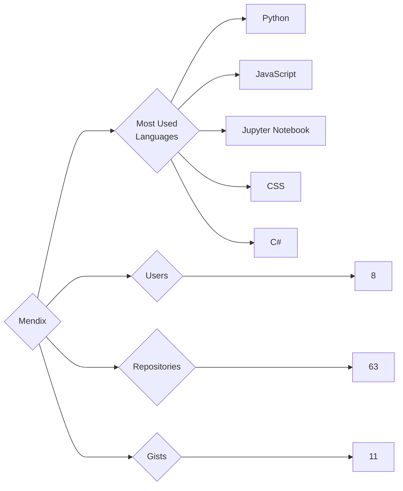

<h1 align="center">Mendix</h1>

```mermaid
graph LR
COMPANY_NAME{Mendix}
COMPANY_NAME ---> U{Users} ---> UN[8]
COMPANY_NAME ---> R{Repositories} ---> RN[63]
COMPANY_NAME ---> G{Gists} ---> GN[11]
COMPANY_NAME ---> ML{Most Used<br>Languages}
ML --> Python[Python]
ML --> JavaScript[JavaScript]
ML --> Jupyter_Notebook[Jupyter Notebook]
ML --> CSS[CSS]
ML --> C#[C#]
```
