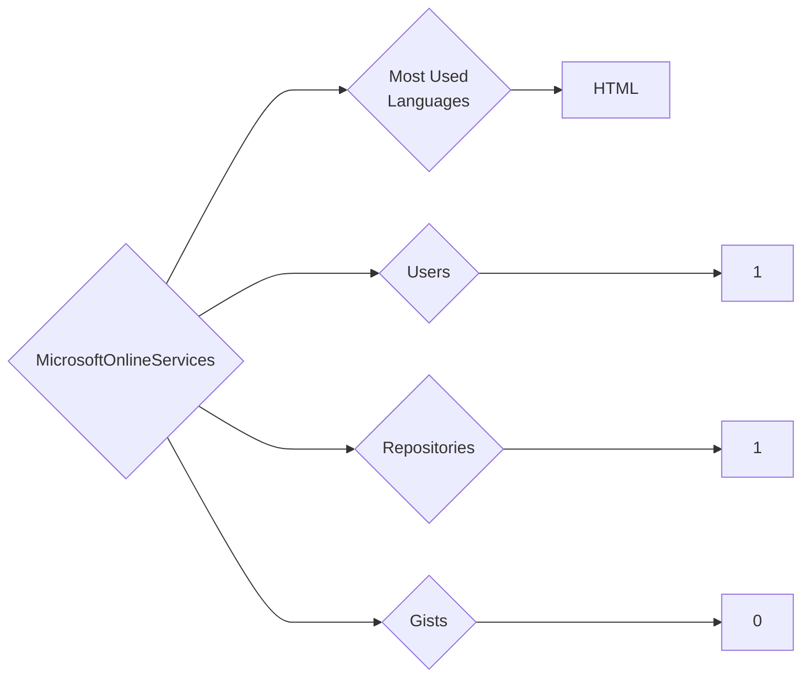

<h1 align="center">MicrosoftOnlineServices</h1>

```mermaid
graph LR
COMPANY_NAME{MicrosoftOnlineServices}
COMPANY_NAME ---> U{Users} ---> UN[1]
COMPANY_NAME ---> R{Repositories} ---> RN[1]
COMPANY_NAME ---> G{Gists} ---> GN[0]
COMPANY_NAME ---> ML{Most Used<br>Languages}
ML --> HTML[HTML]
```
