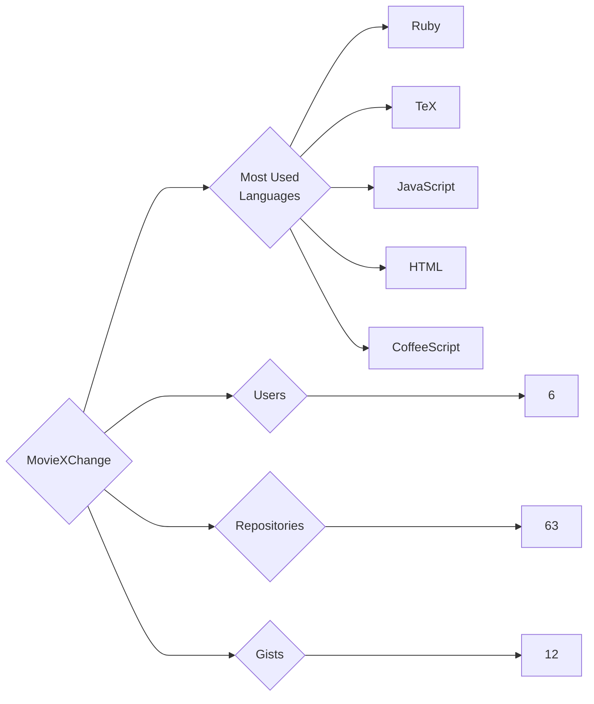

<h1 align="center">MovieXChange</h1>

```mermaid
graph LR
COMPANY_NAME{MovieXChange}
COMPANY_NAME ---> U{Users} ---> UN[6]
COMPANY_NAME ---> R{Repositories} ---> RN[63]
COMPANY_NAME ---> G{Gists} ---> GN[12]
COMPANY_NAME ---> ML{Most Used<br>Languages}
ML --> Ruby[Ruby]
ML --> TeX[TeX]
ML --> JavaScript[JavaScript]
ML --> HTML[HTML]
ML --> CoffeeScript[CoffeeScript]
```
