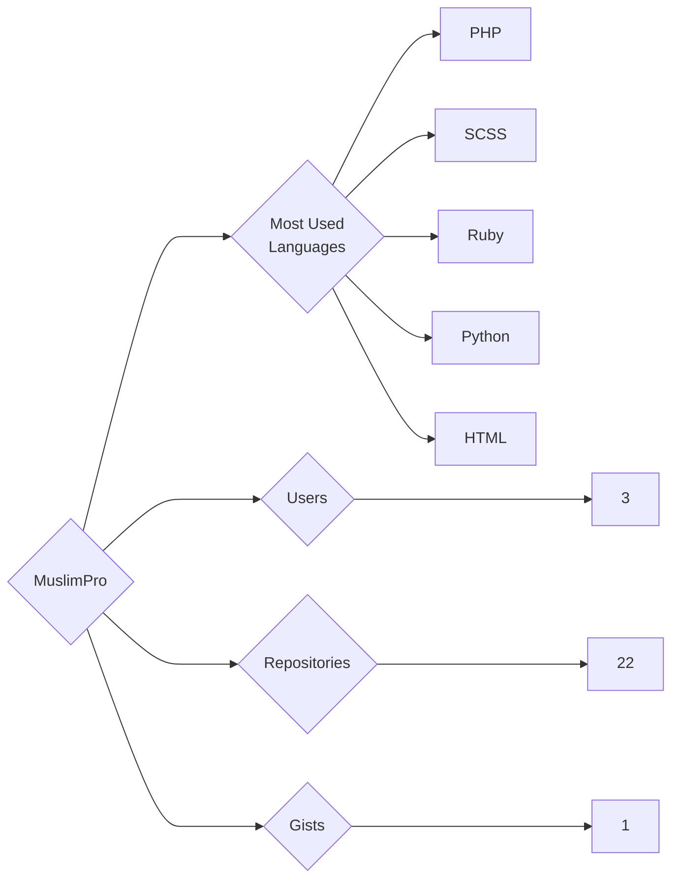

<h1 align="center">MuslimPro</h1>

```mermaid
graph LR
COMPANY_NAME{MuslimPro}
COMPANY_NAME ---> U{Users} ---> UN[3]
COMPANY_NAME ---> R{Repositories} ---> RN[22]
COMPANY_NAME ---> G{Gists} ---> GN[1]
COMPANY_NAME ---> ML{Most Used<br>Languages}
ML --> PHP[PHP]
ML --> SCSS[SCSS]
ML --> Ruby[Ruby]
ML --> Python[Python]
ML --> HTML[HTML]
```
