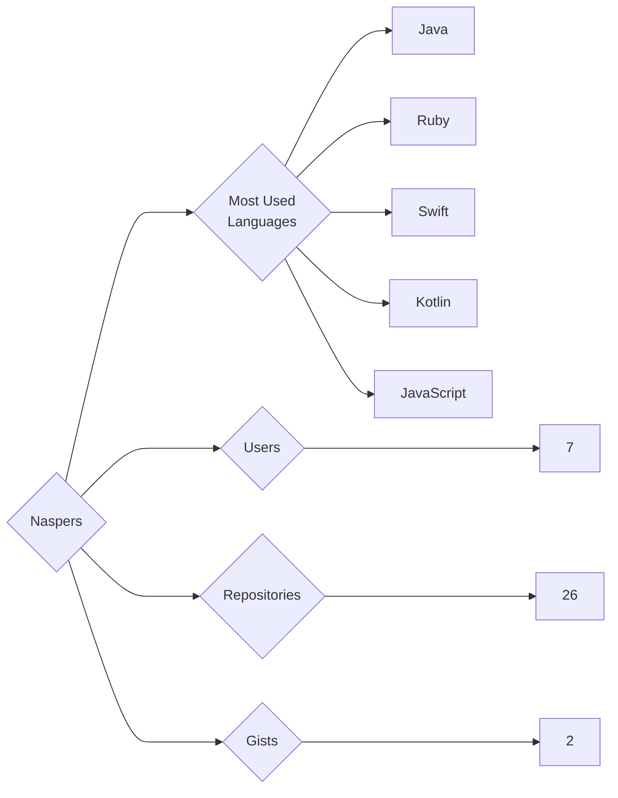

<h1 align="center">Naspers</h1>

```mermaid
graph LR
COMPANY_NAME{Naspers}
COMPANY_NAME ---> U{Users} ---> UN[7]
COMPANY_NAME ---> R{Repositories} ---> RN[26]
COMPANY_NAME ---> G{Gists} ---> GN[2]
COMPANY_NAME ---> ML{Most Used<br>Languages}
ML --> Java[Java]
ML --> Ruby[Ruby]
ML --> Swift[Swift]
ML --> Kotlin[Kotlin]
ML --> JavaScript[JavaScript]
```
