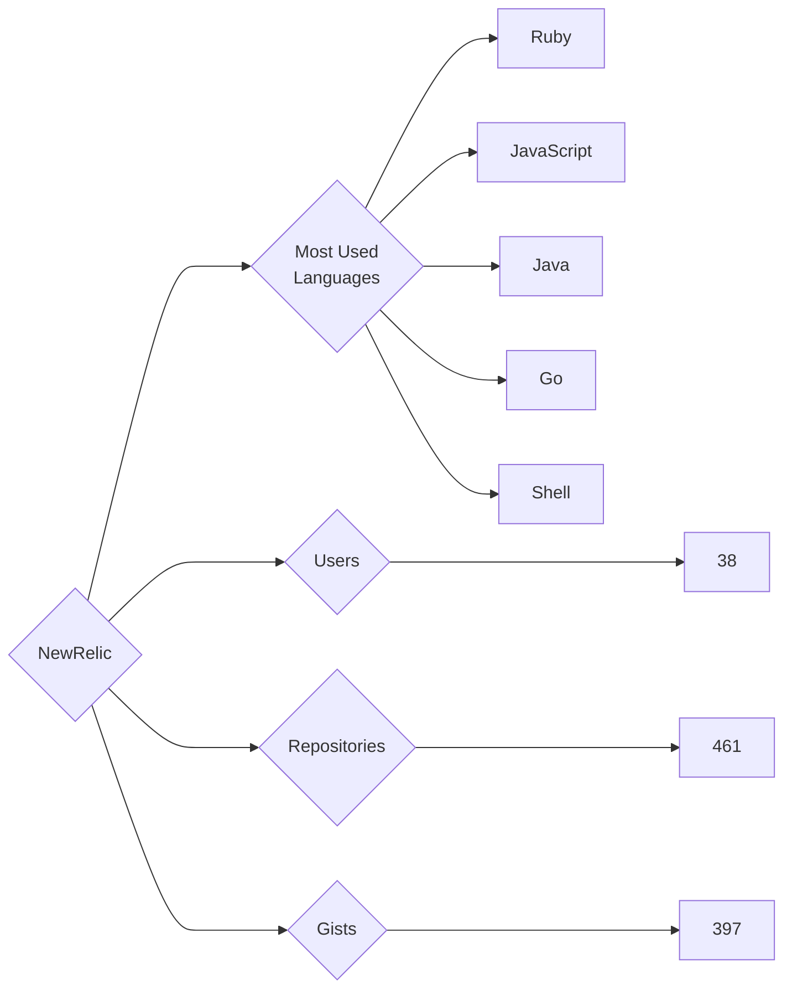

<h1 align="center">NewRelic</h1>

```mermaid
graph LR
COMPANY_NAME{NewRelic}
COMPANY_NAME ---> U{Users} ---> UN[38]
COMPANY_NAME ---> R{Repositories} ---> RN[461]
COMPANY_NAME ---> G{Gists} ---> GN[397]
COMPANY_NAME ---> ML{Most Used<br>Languages}
ML --> Ruby[Ruby]
ML --> JavaScript[JavaScript]
ML --> Java[Java]
ML --> Go[Go]
ML --> Shell[Shell]
```
