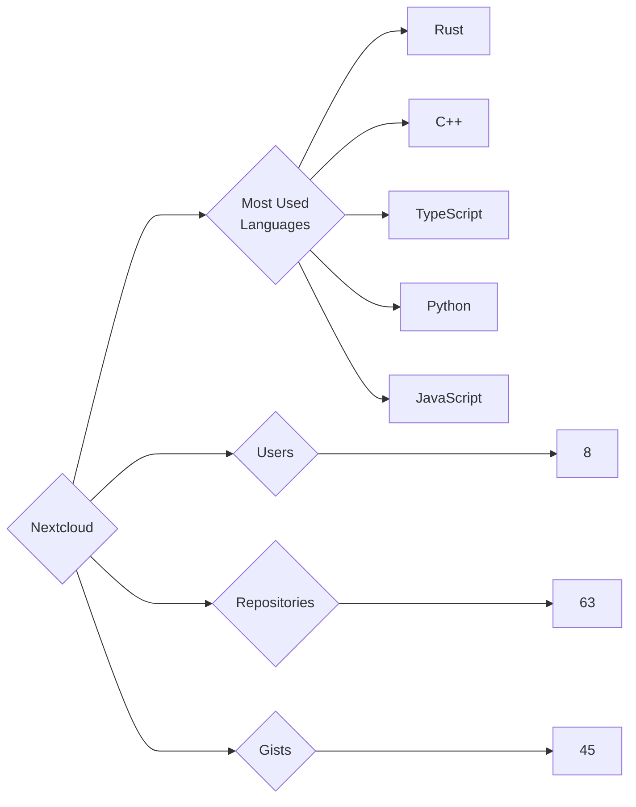

<h1 align="center">Nextcloud</h1>

```mermaid
graph LR
COMPANY_NAME{Nextcloud}
COMPANY_NAME ---> U{Users} ---> UN[8]
COMPANY_NAME ---> R{Repositories} ---> RN[63]
COMPANY_NAME ---> G{Gists} ---> GN[45]
COMPANY_NAME ---> ML{Most Used<br>Languages}
ML --> Rust[Rust]
ML --> C++[C++]
ML --> TypeScript[TypeScript]
ML --> Python[Python]
ML --> JavaScript[JavaScript]
```
