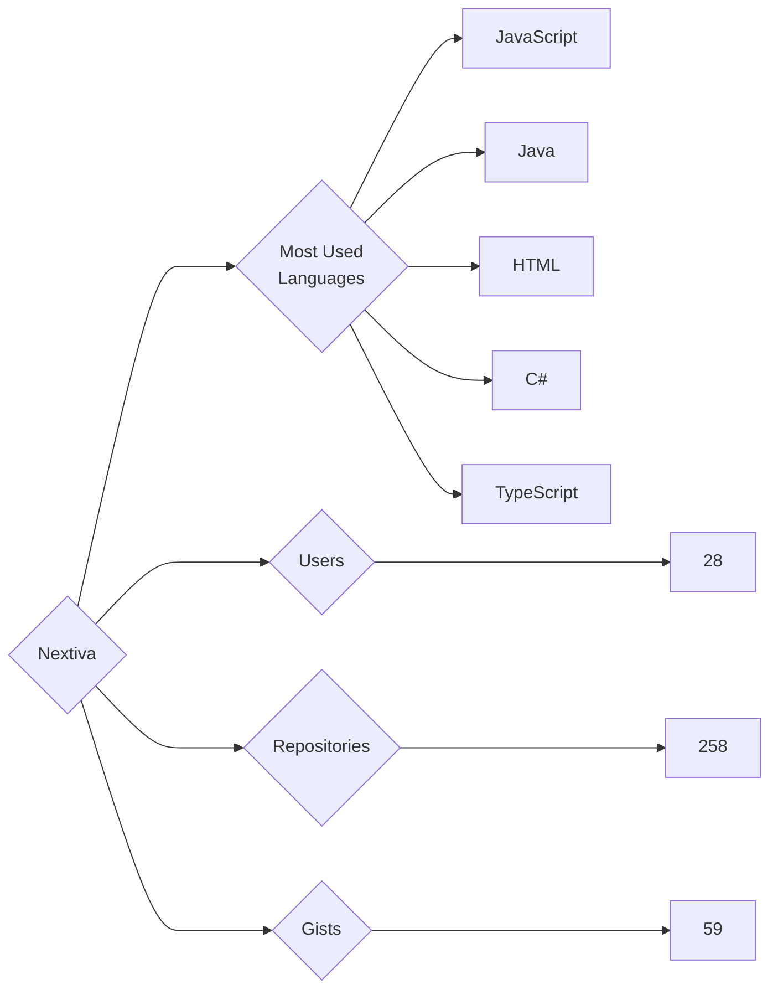

<h1 align="center">Nextiva</h1>

```mermaid
graph LR
COMPANY_NAME{Nextiva}
COMPANY_NAME ---> U{Users} ---> UN[28]
COMPANY_NAME ---> R{Repositories} ---> RN[258]
COMPANY_NAME ---> G{Gists} ---> GN[59]
COMPANY_NAME ---> ML{Most Used<br>Languages}
ML --> JavaScript[JavaScript]
ML --> Java[Java]
ML --> HTML[HTML]
ML --> C#[C#]
ML --> TypeScript[TypeScript]
```
