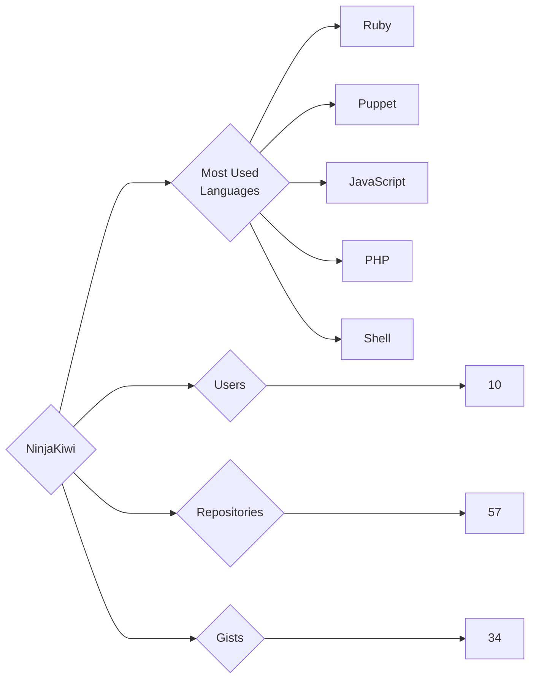

<h1 align="center">NinjaKiwi</h1>

```mermaid
graph LR
COMPANY_NAME{NinjaKiwi}
COMPANY_NAME ---> U{Users} ---> UN[10]
COMPANY_NAME ---> R{Repositories} ---> RN[57]
COMPANY_NAME ---> G{Gists} ---> GN[34]
COMPANY_NAME ---> ML{Most Used<br>Languages}
ML --> Ruby[Ruby]
ML --> Puppet[Puppet]
ML --> JavaScript[JavaScript]
ML --> PHP[PHP]
ML --> Shell[Shell]
```
