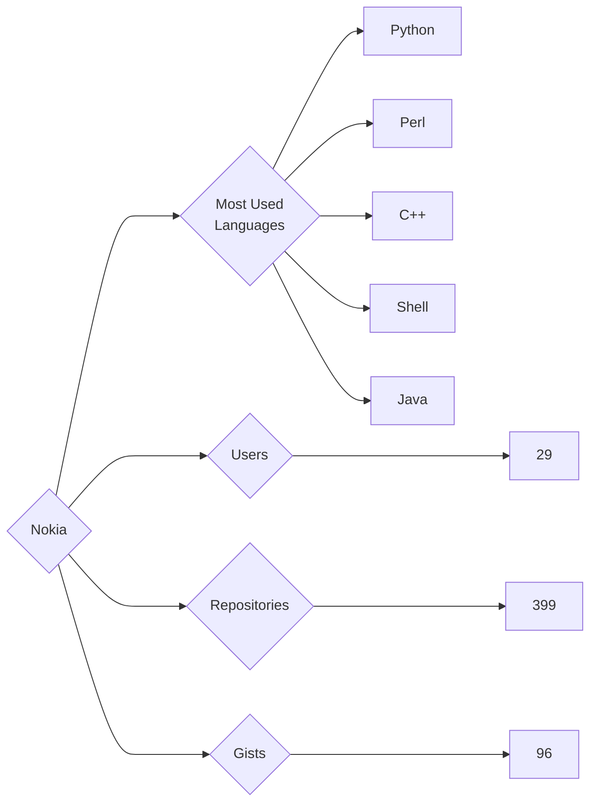

<h1 align="center">Nokia</h1>

```mermaid
graph LR
COMPANY_NAME{Nokia}
COMPANY_NAME ---> U{Users} ---> UN[29]
COMPANY_NAME ---> R{Repositories} ---> RN[399]
COMPANY_NAME ---> G{Gists} ---> GN[96]
COMPANY_NAME ---> ML{Most Used<br>Languages}
ML --> Python[Python]
ML --> Perl[Perl]
ML --> C++[C++]
ML --> Shell[Shell]
ML --> Java[Java]
```
