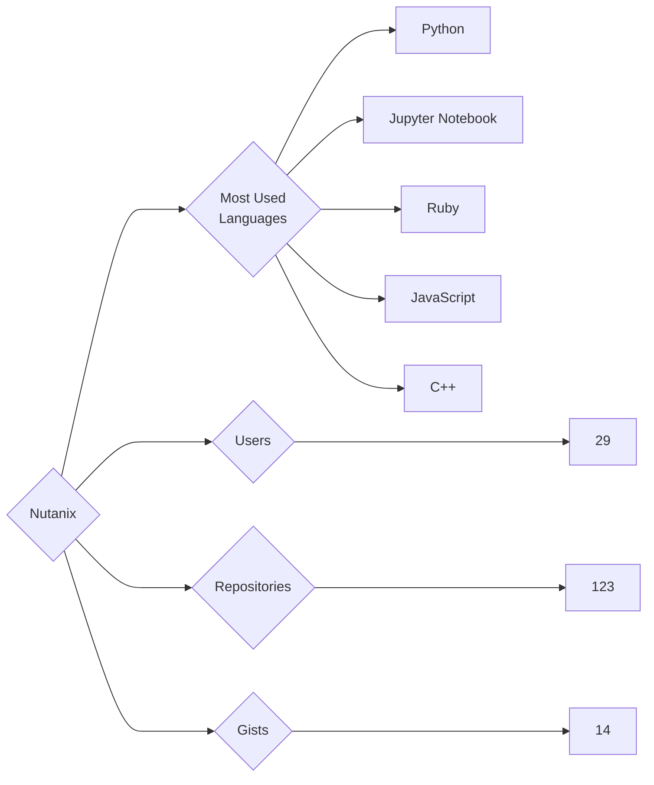

<h1 align="center">Nutanix</h1>

```mermaid
graph LR
COMPANY_NAME{Nutanix}
COMPANY_NAME ---> U{Users} ---> UN[29]
COMPANY_NAME ---> R{Repositories} ---> RN[123]
COMPANY_NAME ---> G{Gists} ---> GN[14]
COMPANY_NAME ---> ML{Most Used<br>Languages}
ML --> Python[Python]
ML --> Jupyter_Notebook[Jupyter Notebook]
ML --> Ruby[Ruby]
ML --> JavaScript[JavaScript]
ML --> C++[C++]
```
