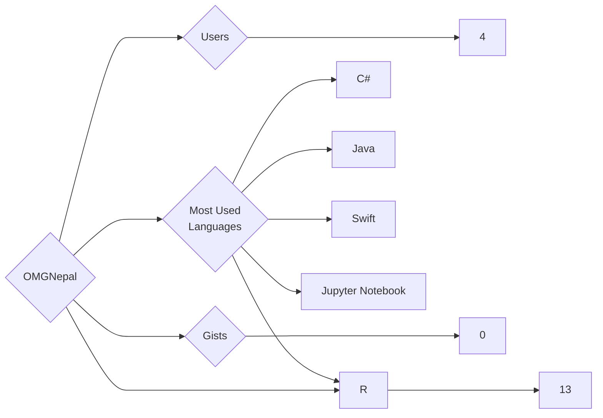

<h1 align="center">OMGNepal</h1>

```mermaid
graph LR
COMPANY_NAME{OMGNepal}
COMPANY_NAME ---> U{Users} ---> UN[4]
COMPANY_NAME ---> R{Repositories} ---> RN[13]
COMPANY_NAME ---> G{Gists} ---> GN[0]
COMPANY_NAME ---> ML{Most Used<br>Languages}
ML --> C#[C#]
ML --> Java[Java]
ML --> Swift[Swift]
ML --> R[R]
ML --> Jupyter_Notebook[Jupyter Notebook]
```
