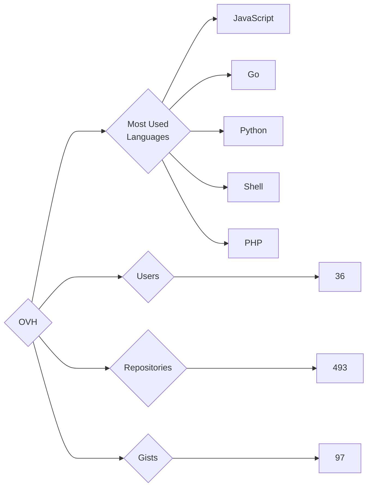

<h1 align="center">OVH</h1>

```mermaid
graph LR
COMPANY_NAME{OVH}
COMPANY_NAME ---> U{Users} ---> UN[36]
COMPANY_NAME ---> R{Repositories} ---> RN[493]
COMPANY_NAME ---> G{Gists} ---> GN[97]
COMPANY_NAME ---> ML{Most Used<br>Languages}
ML --> JavaScript[JavaScript]
ML --> Go[Go]
ML --> Python[Python]
ML --> Shell[Shell]
ML --> PHP[PHP]
```
