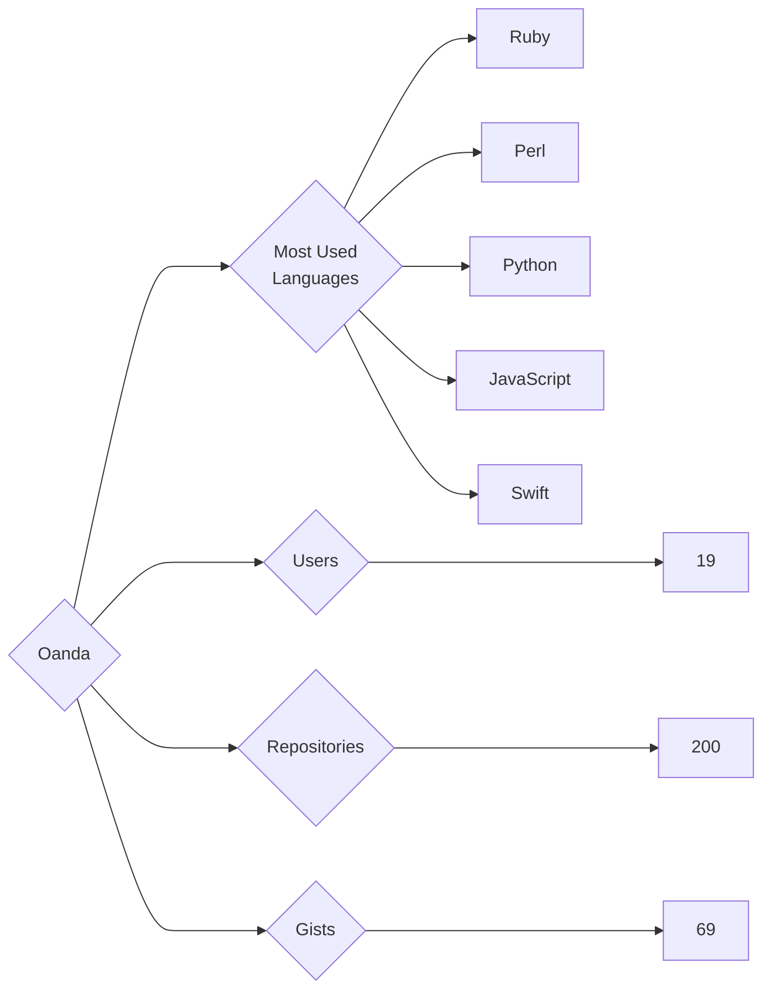

<h1 align="center">Oanda</h1>

```mermaid
graph LR
COMPANY_NAME{Oanda}
COMPANY_NAME ---> U{Users} ---> UN[19]
COMPANY_NAME ---> R{Repositories} ---> RN[200]
COMPANY_NAME ---> G{Gists} ---> GN[69]
COMPANY_NAME ---> ML{Most Used<br>Languages}
ML --> Ruby[Ruby]
ML --> Perl[Perl]
ML --> Python[Python]
ML --> JavaScript[JavaScript]
ML --> Swift[Swift]
```
