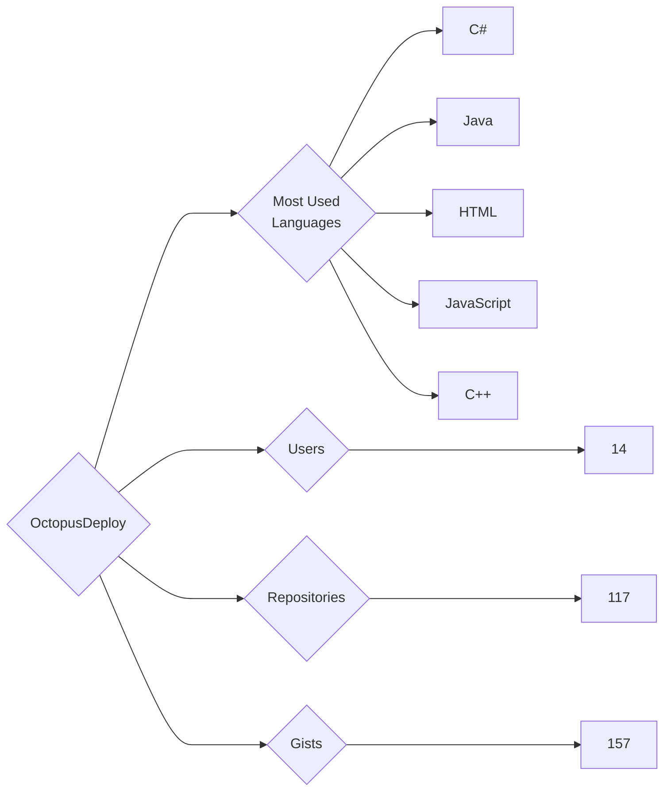

<h1 align="center">OctopusDeploy</h1>

```mermaid
graph LR
COMPANY_NAME{OctopusDeploy}
COMPANY_NAME ---> U{Users} ---> UN[14]
COMPANY_NAME ---> R{Repositories} ---> RN[117]
COMPANY_NAME ---> G{Gists} ---> GN[157]
COMPANY_NAME ---> ML{Most Used<br>Languages}
ML --> C#[C#]
ML --> Java[Java]
ML --> HTML[HTML]
ML --> JavaScript[JavaScript]
ML --> C++[C++]
```
