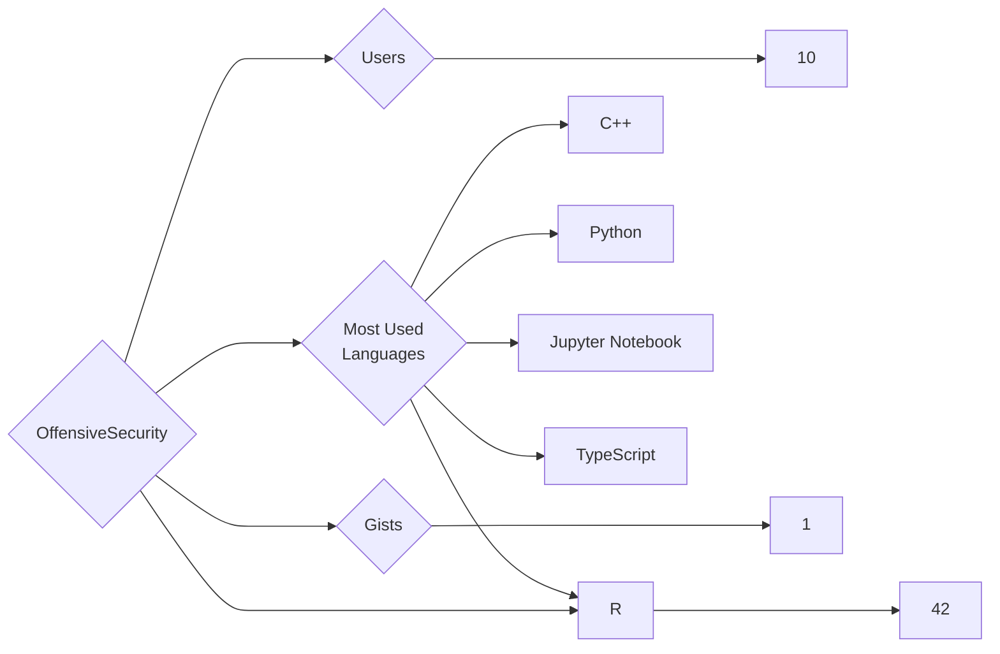

<h1 align="center">OffensiveSecurity</h1>

```mermaid
graph LR
COMPANY_NAME{OffensiveSecurity}
COMPANY_NAME ---> U{Users} ---> UN[10]
COMPANY_NAME ---> R{Repositories} ---> RN[42]
COMPANY_NAME ---> G{Gists} ---> GN[1]
COMPANY_NAME ---> ML{Most Used<br>Languages}
ML --> C++[C++]
ML --> Python[Python]
ML --> Jupyter_Notebook[Jupyter Notebook]
ML --> TypeScript[TypeScript]
ML --> R[R]
```
