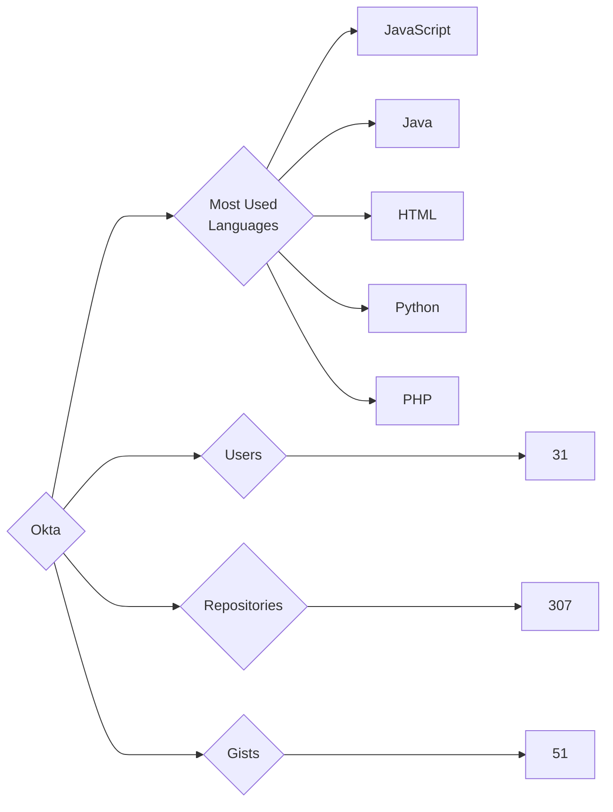

<h1 align="center">Okta</h1>

```mermaid
graph LR
COMPANY_NAME{Okta}
COMPANY_NAME ---> U{Users} ---> UN[31]
COMPANY_NAME ---> R{Repositories} ---> RN[307]
COMPANY_NAME ---> G{Gists} ---> GN[51]
COMPANY_NAME ---> ML{Most Used<br>Languages}
ML --> JavaScript[JavaScript]
ML --> Java[Java]
ML --> HTML[HTML]
ML --> Python[Python]
ML --> PHP[PHP]
```
