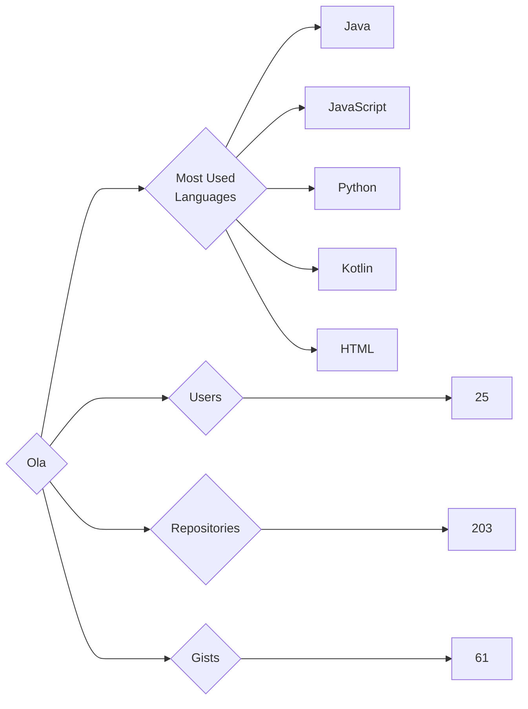

<h1 align="center">Ola</h1>

```mermaid
graph LR
COMPANY_NAME{Ola}
COMPANY_NAME ---> U{Users} ---> UN[25]
COMPANY_NAME ---> R{Repositories} ---> RN[203]
COMPANY_NAME ---> G{Gists} ---> GN[61]
COMPANY_NAME ---> ML{Most Used<br>Languages}
ML --> Java[Java]
ML --> JavaScript[JavaScript]
ML --> Python[Python]
ML --> Kotlin[Kotlin]
ML --> HTML[HTML]
```
