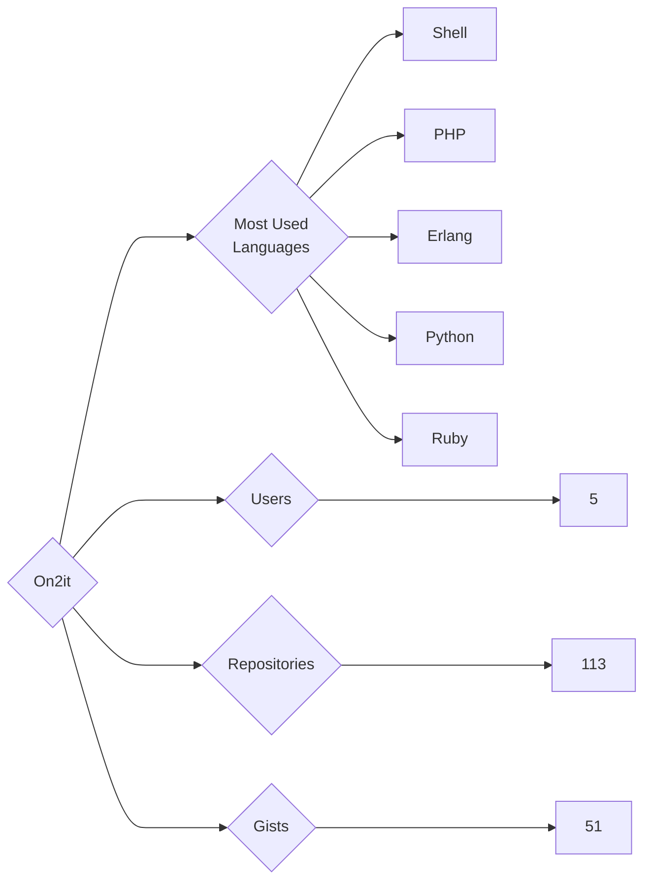

<h1 align="center">On2it</h1>

```mermaid
graph LR
COMPANY_NAME{On2it}
COMPANY_NAME ---> U{Users} ---> UN[5]
COMPANY_NAME ---> R{Repositories} ---> RN[113]
COMPANY_NAME ---> G{Gists} ---> GN[51]
COMPANY_NAME ---> ML{Most Used<br>Languages}
ML --> Shell[Shell]
ML --> PHP[PHP]
ML --> Erlang[Erlang]
ML --> Python[Python]
ML --> Ruby[Ruby]
```
