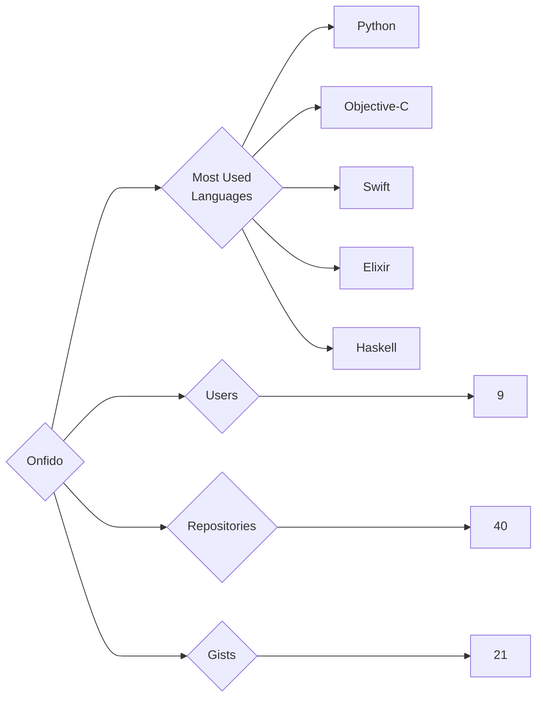

<h1 align="center">Onfido</h1>

```mermaid
graph LR
COMPANY_NAME{Onfido}
COMPANY_NAME ---> U{Users} ---> UN[9]
COMPANY_NAME ---> R{Repositories} ---> RN[40]
COMPANY_NAME ---> G{Gists} ---> GN[21]
COMPANY_NAME ---> ML{Most Used<br>Languages}
ML --> Python[Python]
ML --> Objective-C[Objective-C]
ML --> Swift[Swift]
ML --> Elixir[Elixir]
ML --> Haskell[Haskell]
```
