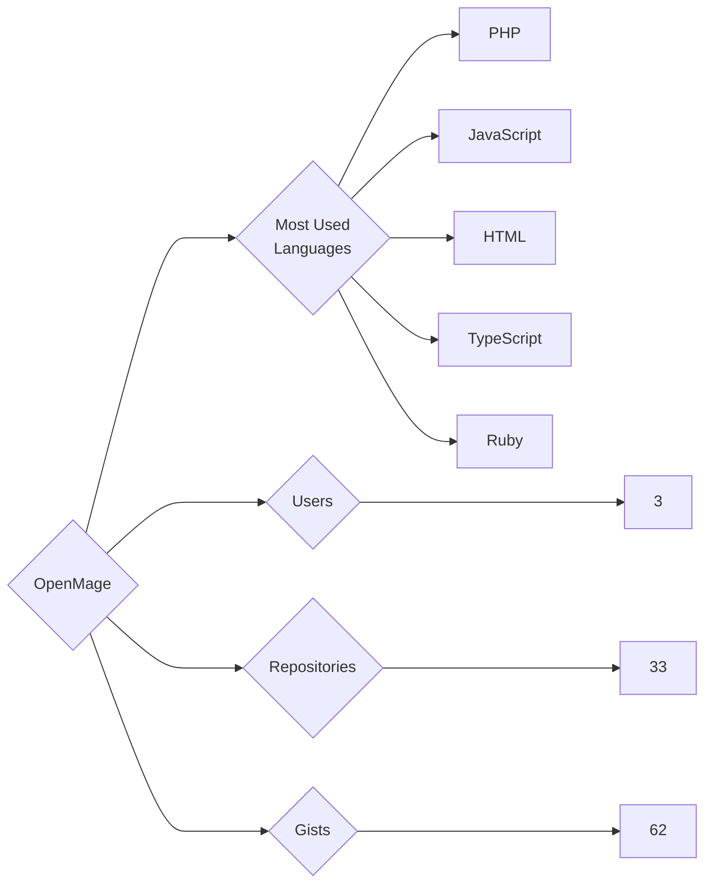

<h1 align="center">OpenMage</h1>

```mermaid
graph LR
COMPANY_NAME{OpenMage}
COMPANY_NAME ---> U{Users} ---> UN[3]
COMPANY_NAME ---> R{Repositories} ---> RN[33]
COMPANY_NAME ---> G{Gists} ---> GN[62]
COMPANY_NAME ---> ML{Most Used<br>Languages}
ML --> PHP[PHP]
ML --> JavaScript[JavaScript]
ML --> HTML[HTML]
ML --> TypeScript[TypeScript]
ML --> Ruby[Ruby]
```
