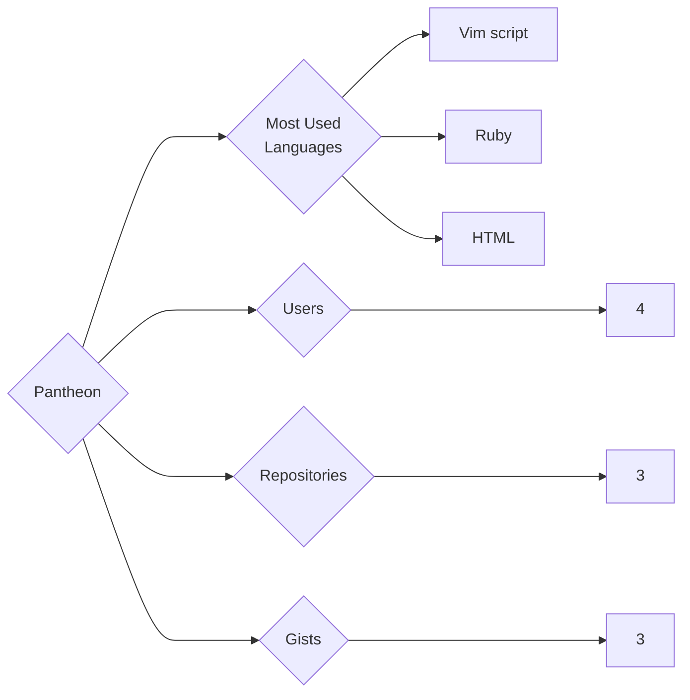

<h1 align="center">Pantheon</h1>

```mermaid
graph LR
COMPANY_NAME{Pantheon}
COMPANY_NAME ---> U{Users} ---> UN[4]
COMPANY_NAME ---> R{Repositories} ---> RN[3]
COMPANY_NAME ---> G{Gists} ---> GN[3]
COMPANY_NAME ---> ML{Most Used<br>Languages}
ML --> Vim_script[Vim script]
ML --> Ruby[Ruby]
ML --> HTML[HTML]
```
