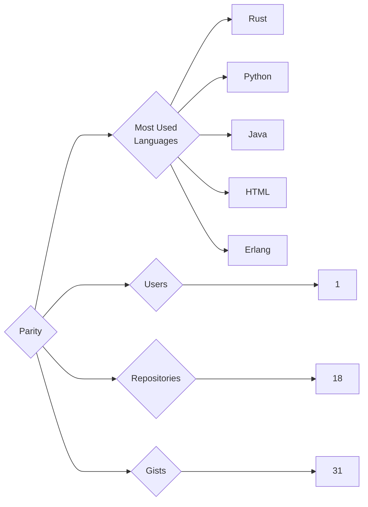

<h1 align="center">Parity</h1>

```mermaid
graph LR
COMPANY_NAME{Parity}
COMPANY_NAME ---> U{Users} ---> UN[1]
COMPANY_NAME ---> R{Repositories} ---> RN[18]
COMPANY_NAME ---> G{Gists} ---> GN[31]
COMPANY_NAME ---> ML{Most Used<br>Languages}
ML --> Rust[Rust]
ML --> Python[Python]
ML --> Java[Java]
ML --> HTML[HTML]
ML --> Erlang[Erlang]
```
