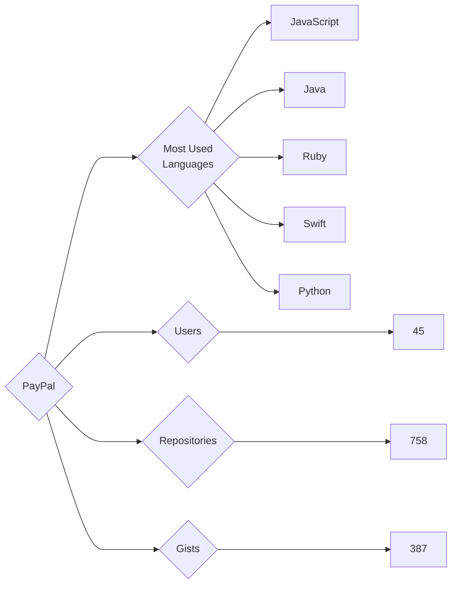

<h1 align="center">PayPal</h1>

```mermaid
graph LR
COMPANY_NAME{PayPal}
COMPANY_NAME ---> U{Users} ---> UN[45]
COMPANY_NAME ---> R{Repositories} ---> RN[758]
COMPANY_NAME ---> G{Gists} ---> GN[387]
COMPANY_NAME ---> ML{Most Used<br>Languages}
ML --> JavaScript[JavaScript]
ML --> Java[Java]
ML --> Ruby[Ruby]
ML --> Swift[Swift]
ML --> Python[Python]
```
