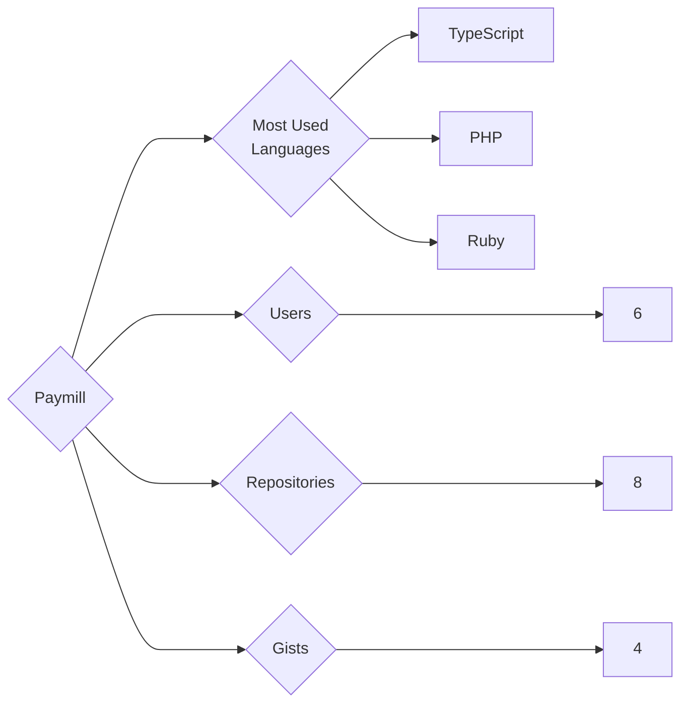

<h1 align="center">Paymill</h1>

```mermaid
graph LR
COMPANY_NAME{Paymill}
COMPANY_NAME ---> U{Users} ---> UN[6]
COMPANY_NAME ---> R{Repositories} ---> RN[8]
COMPANY_NAME ---> G{Gists} ---> GN[4]
COMPANY_NAME ---> ML{Most Used<br>Languages}
ML --> TypeScript[TypeScript]
ML --> PHP[PHP]
ML --> Ruby[Ruby]
```
