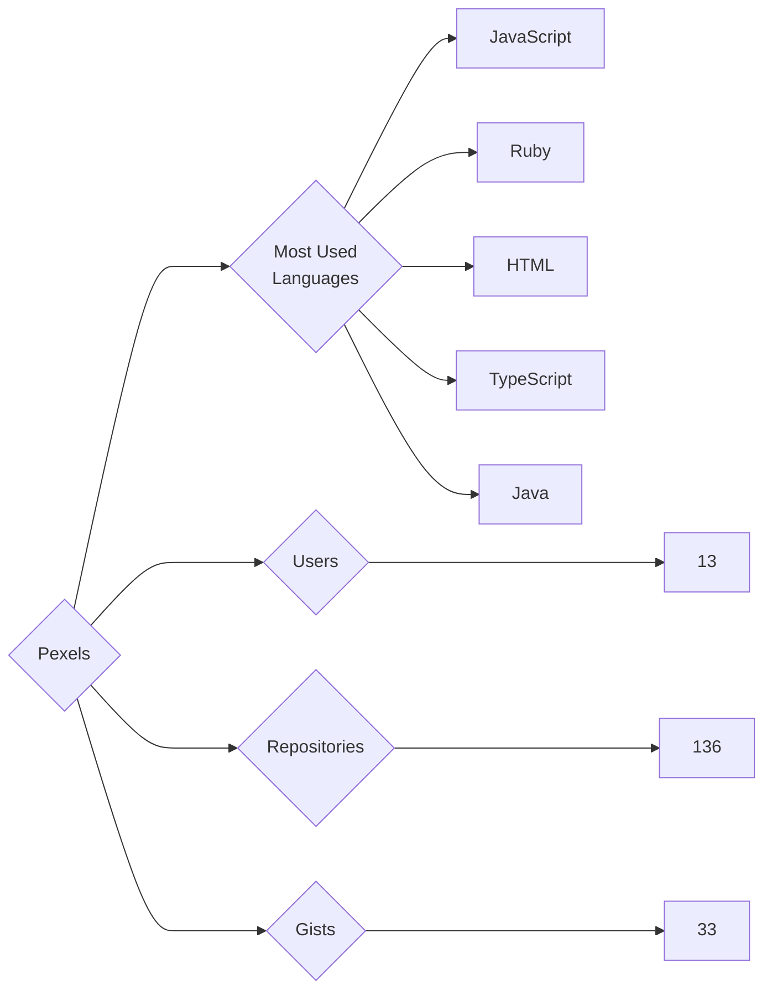

<h1 align="center">Pexels</h1>

```mermaid
graph LR
COMPANY_NAME{Pexels}
COMPANY_NAME ---> U{Users} ---> UN[13]
COMPANY_NAME ---> R{Repositories} ---> RN[136]
COMPANY_NAME ---> G{Gists} ---> GN[33]
COMPANY_NAME ---> ML{Most Used<br>Languages}
ML --> JavaScript[JavaScript]
ML --> Ruby[Ruby]
ML --> HTML[HTML]
ML --> TypeScript[TypeScript]
ML --> Java[Java]
```
